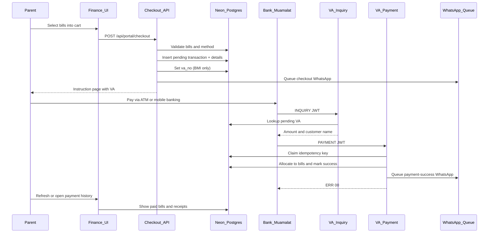
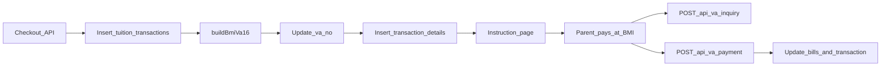
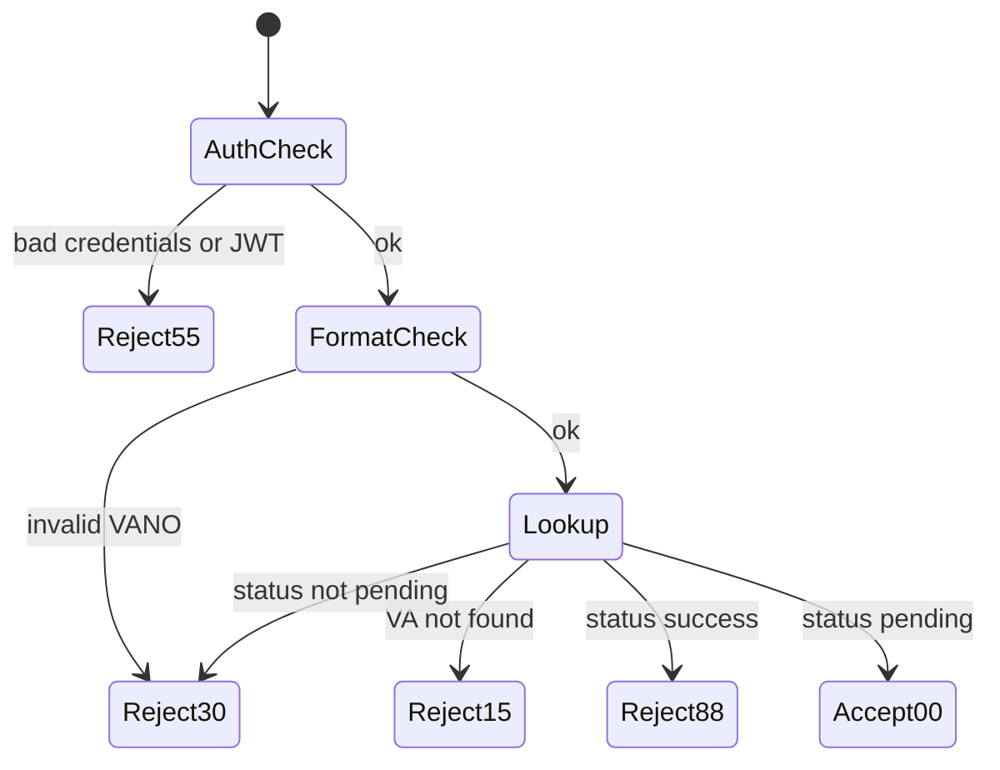
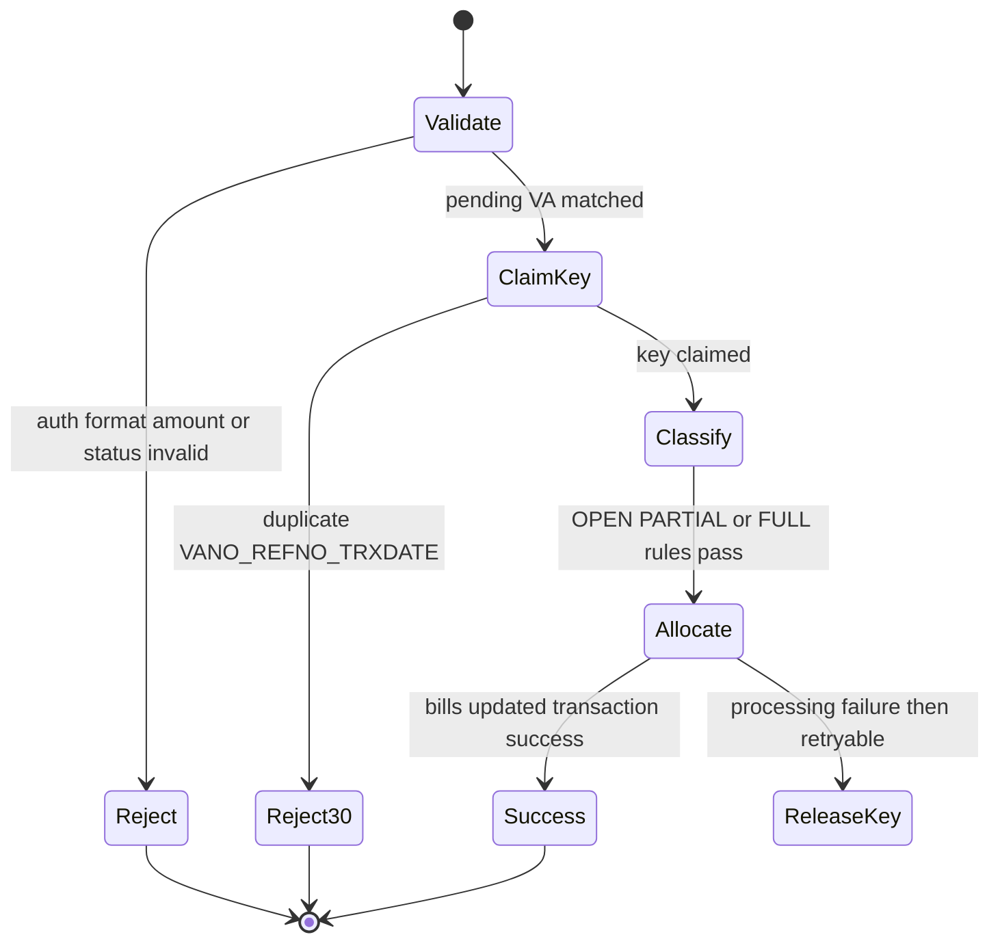
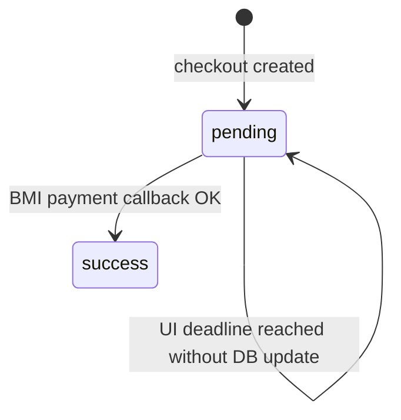
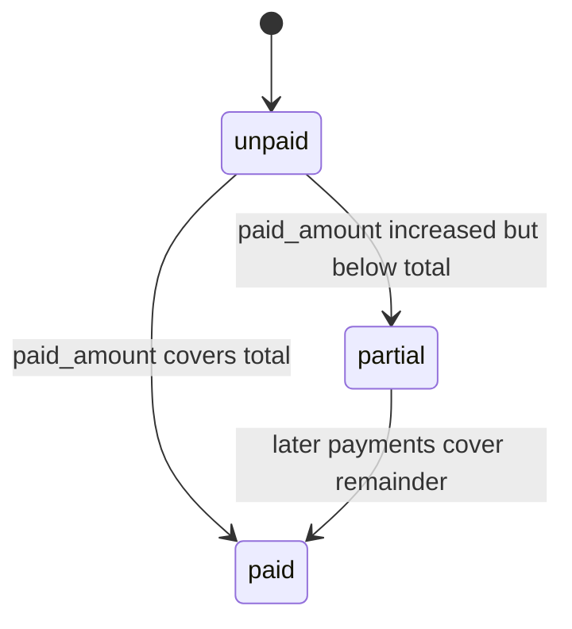
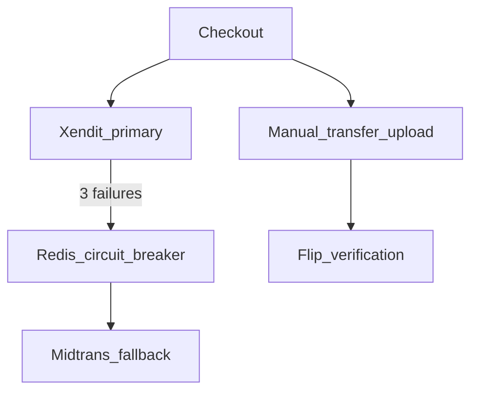

# Tuition Payment Mechanism

**Audience:** engineers, tech leads, and finance implementers  
**Language:** English (Indonesian business terms explained in the [Glossary](#29-glossary))  
**Status:** Documents current runtime behavior plus planned architecture. Several production decisions remain open (see [Known gaps](#27-known-implementation-gaps)).

---

## 1. Purpose and scope

This document explains how tuition (SPP) and installment (cicilan) payments work in the Parent Portal:

1. How a parent selects bills and checks out.
2. Which database tables and views are read or written at each step.
3. How a Bank Muamalat Indonesia (BMI) Virtual Account (VA) number is generated.
4. How BMI inquiry and payment callbacks settle bills.
5. What is implemented today versus what is still planned (Xendit / Midtrans / Flip).

### What this document covers

| Topic | Covered |
| --- | --- |
| Current BMI H2H VA checkout and settlement | Yes |
| Database table interactions | Yes |
| VA generation formula | Yes (pending bank confirmation for digits 5–6) |
| Planned multi-gateway architecture | Yes (labeled as planned) |
| Admin bill generation / tariff CRUD | No (out of portal scope) |

---

## 2. Source hierarchy and implementation status

Use this authority order when sources conflict:

1. Locked baseline schema: [`refs/kgs_scheme.sql`](../refs/kgs_scheme.sql)
2. Product intent: [`refs/PRD-ParentPortal.md.md`](../refs/PRD-ParentPortal.md.md)
3. Target technical architecture: [`refs/TRD-ParentPortal.md.md`](../refs/TRD-ParentPortal.md.md)
4. Current executable behavior: `app/`, `lib/`, `sql/`
5. UX prototype (reference only): [`refs/kgs.jsx`](../refs/kgs.jsx)
6. BMI protocol reference: [`refs/muamalat-va-h2h-implementation.md`](../refs/muamalat-va-h2h-implementation.md)

### Implementation status

| Capability | Status |
| --- | --- |
| BMI H2H Virtual Account | **Current / implemented** |
| Checkout → pending transaction → bill allocation on callback | **Current / implemented** |
| WhatsApp checkout + payment-success notifications | **Current / implemented** |
| Payment history, instructions, receipt PDF | **Current / implemented** |
| Xendit primary + Midtrans failover + circuit breaker | **Planned (TRD)** — not found in runtime |
| Flip / manual-transfer verification | **Planned (PRD/TRD)** — not found in runtime |
| Multi-child cart in one transaction | **PRD/prototype** — server currently rejects |

---

## 3. Payment terminology

| Term | Meaning |
| --- | --- |
| Bill / tagihan | One payable row in `tuition_bills` (monthly SPP, DSP, DKT, etc.) |
| Cart | Browser-side selection of bills and amounts before checkout |
| Checkout | Server validation + creation of `tuition_transactions` + details |
| Transaction | Payment header (`tuition_transactions`) |
| Transaction detail | One allocated bill line (`tuition_transaction_details`) |
| VA / Virtual Account | 16-digit number paid through a bank channel |
| BMI H2H | Host-to-host protocol with Bank Muamalat Indonesia |
| Inquiry | Bank asks “what is owed for this VA?” |
| Payment callback | Bank notifies “this VA was paid” |
| Idempotency | Same bank callback must not settle twice |

---

## 4. End-to-end tuition lifecycle



### High-level stages

1. **Finance dashboard** — load unpaid balances.
2. **Cart** — parent selects monthly/previous-year/installment items.
3. **Payment method** — choose a published channel (BMI VA is the operational path).
4. **Checkout** — server creates a pending transaction and (for BMI) a VA.
5. **Instructions** — show VA, deadline, and bank steps.
6. **BMI inquiry** — bank validates the VA and amount.
7. **BMI payment** — bank settles; bills and transaction update.
8. **History / receipt / WhatsApp** — parent sees confirmation.

---

## 5. Finance dashboard and bill-balance formulas

### Views

| View | Purpose |
| --- | --- |
| `v_portal_finance_bills` | Flat bill list with product, academic year, and balance |
| `v_portal_tuition_payment_lines` | Paid lines for installment history |

Source: [`sql/portal_finance_views.sql`](../sql/portal_finance_views.sql)

### Current balance formula (implemented)

```text
balance_amount = GREATEST(total_amount - paid_amount, 0)
```

### Fully paid formula (implemented)

```text
is_fully_paid =
  paid_amount >= total_amount
  OR lower(status) = 'paid'
```

### Discount-aware formula (recommended in SQL comments, not active in the view)

```text
balance_amount = GREATEST(
  total_amount - paid_amount - COALESCE(discount_amount, 0),
  0
)
```

`tuition_bills.discount_amount` exists in the locked schema, but the active portal view and payment callback currently ignore it. Treat discount handling as unresolved drift until production confirms one formula everywhere.

### Fictional example

| Field | Value |
| --- | --- |
| `total_amount` | `800000.00` |
| `paid_amount` | `200000.00` |
| `balance_amount` | `600000.00` |

---

## 6. Cart rules and server-side validation

### Cart item ID formats (client)

| Kind | ID pattern |
| --- | --- |
| Monthly SPP | `spp-{studentId}-{billId}` |
| Previous-year bill | `prev-{studentId}-{billId}` |
| Installment | `inst-{billId}` |

### Server validation (`finalizePortalCheckout`)

Source: [`lib/data/server/checkout.ts`](../lib/data/server/checkout.ts)

The server never trusts client amounts. It reloads bills from `v_portal_finance_bills` and enforces:

| Rule | Behavior |
| --- | --- |
| Non-empty cart | Reject `EMPTY_CART` |
| Exactly one student | Reject `MULTI_STUDENT` |
| Viewer can access student | Reject `FORBIDDEN_STUDENT` |
| Method active + published | Reject `METHOD_NOT_FOUND` / `METHOD_FORBIDDEN` |
| Bills exist for that student | Reject `BILL_NOT_FOUND` |
| One academic year only | Reject `MIXED_ACADEMIC_YEAR` |
| Amount > 0 | Reject `INVALID_AMOUNT` |
| Amount ≤ balance (+ 0.005 tolerance) | Reject `AMOUNT_EXCEEDS_BALANCE` |
| Installment partial ≥ `min_payment` (or 1) | Reject `BELOW_MIN_PAYMENT` |

### Installment minimum rule

```text
if installment AND payAmount < balance:
  floor = min_payment > 0 ? min_payment : 1
  require payAmount + 0.005 >= floor
```

### Fictional installment example

| Field | Value |
| --- | --- |
| Remaining balance | `5_000_000` |
| `min_payment` | `500_000` |
| Parent pays | `750_000` |
| Result | Accepted |

If parent pays `400_000`, checkout rejects `BELOW_MIN_PAYMENT`.

---

## 7. Payment-method eligibility

Source: [`lib/data/server/payment-methods.ts`](../lib/data/server/payment-methods.ts)

A method is shown when:

```text
is_active IS TRUE
AND is_publish IS TRUE
AND (school_id IS NULL OR school_id is one of the viewer's children's schools)
```

BMI detection (application-level):

```text
UPPER(vendor) = 'BMI' OR UPPER(code) = 'BMI'
```

Source: [`lib/utils/bmi-method.ts`](../lib/utils/bmi-method.ts)

**Important:** Non-BMI methods can be selected and can create a pending transaction, but they currently do **not** generate a VA, redirect URL, QR code, or gateway charge. After checkout, BMI is the only path that continues to `/instruction/[vaNo]`.

---

## 8. Transaction and detail creation

### Writes

1. `INSERT` into `tuition_transactions` with `status = 'pending'`, `va_no = NULL`.
2. For BMI: compute VA, then `UPDATE tuition_transactions SET va_no = ...`.
3. `INSERT` one `tuition_transaction_details` row per cart bill.

### Transaction total

```text
transaction.total_amount = Σ cart_item.amount
```

### Reference number (business reference, not VA)

```text
reference_no = TRX-{unix_ms}-{6_random_base36_chars}
```

Fictional example:

```text
TRX-1753092000123-A9F3K2
```

There is no collision retry. The locked schema uniqueness is `(reference_no, created_at)`, not a global unique `reference_no`.

### Checkout failure cleanup

If detail insert fails after the header insert, the code attempts compensating deletes of details and the transaction. These are separate SQL statements, not one atomic database transaction.

---

## 9. Current BMI VA architecture



BMI endpoints (JWT HS256):

| Endpoint | Role |
| --- | --- |
| `POST /api/va/signon` | Session start (no DB persistence today) |
| `POST /api/va/signoff` | Session end (no DB persistence today) |
| `POST /api/va/echo` | Heartbeat |
| `POST /api/va/inquiry` | Billing lookup |
| `POST /api/va/payment` | Settlement |
| `POST /api/va` | Consolidated handler (behavior can diverge; see gaps) |

---

## 10. VA format and generation algorithm

### Bank guide (BMI reference)

```text
VA16 = BIN4 + PRODUCT2 + CUSTOMER10
```

Source: [`refs/muamalat-va-h2h-implementation.md`](../refs/muamalat-va-h2h-implementation.md)

### Current application formula (implemented)

```text
VA16 = BIN4 + SCHOOL2 + TRANSACTION10
```

Source: [`lib/va/bmi-va.ts`](../lib/va/bmi-va.ts)

> **Pending bank confirmation:** Digits 5–6 are currently treated as a school code (`SCHOOL2`). The BMI H2H guide defines those digits as a product code (`PRODUCT2`). Do not treat `SCHOOL2` as final until BMI confirms the partner namespace in writing.

### Component rules

| Part | Length | Source | Rule |
| --- | --- | --- | --- |
| `BIN4` | 4 | `core_schools.bank_channel_code` | Digits only; left-pad if short; take first 4 |
| `SCHOOL2` | 2 | `core_schools.school_code` | Digits only; left-pad; take **last** 2 |
| `TRANSACTION10` | 10 | `tuition_transactions.id` | Decimal ID; left-pad to 10; take **last** 10 |

### Fallback (current code, not bank-approved)

If `bank_channel_code` or `school_code` is missing, checkout falls back to `core_schools.id` for both. A school database ID is **not** a substitute for a BMI-assigned BIN. Production should fail closed when VA configuration is missing.

### Fictional worked example

```text
bank_channel_code = 7383
school_code        = 01
transaction_id     = 12345

BIN4          = 7383
SCHOOL2       = 01
TRANSACTION10 = 0000012345

VA            = 7383010000012345
Display       = 7383 0100 0001 2345
```

---

## 11. VA uniqueness assumptions and database constraints

Current uniqueness is **assumed**, not enforced:

- No unique index/constraint on `tuition_transactions.va_no` in the locked schema.
- VA uniqueness requires all of the following to hold:
  - Transaction IDs are globally unique across partitions.
  - IDs never wrap past the last 10 digits (`10_000_000_000`).
  - Every school has a distinct 2-digit school code (or confirmed product namespace).
  - BMI BIN configuration is correct per school.

BMI inquiry/payment look up the latest transaction by normalized `va_no` globally. Tenant isolation for bank callbacks therefore depends on collision-free VA numbers.

**Recommended invariant (not yet in locked schema):**

```text
UNIQUE(va_no)
```

---

## 12. BMI JWT authentication and endpoint contracts

All BMI messages are JWT (HS256). Amounts on the wire are scaled by 100:

```text
BILL_out     = round(transaction.total_amount × 100)   # as string digits
bill_amount  = Number(BILL) / 100                      # callback input
payment_amt  = Number(PAYMENT) / 100
```

Fictional scaling:

```text
IDR 800000.00  →  BMI BILL "80000000"
```

Currency code: `CCY = "360"` (IDR).

---

## 13. Inquiry state machine and response codes

Source: [`app/api/va/inquiry/route.ts`](../app/api/va/inquiry/route.ts)



| ERR | Meaning in current inquiry handler |
| --- | --- |
| `00` | Pending VA found; return amount and customer |
| `15` | VA not found |
| `30` | Format / invalid non-pending state |
| `55` | Auth / JWT failure |
| `88` | Already paid (`success`) |

Inquiry returns the checkout header `total_amount`, not a live recompute of current bill balances.

Customer name rules: uppercase letters/spaces only, max 30 characters.

---

## 14. Payment callback state machine

Source: [`app/api/va/payment/route.ts`](../app/api/va/payment/route.ts)



### Preconditions

- Normalized `va_no` matches the latest pending transaction.
- Callback `BILL / 100` equals `tuition_transactions.total_amount` within `0.02`.
- Idempotency key claimed successfully.

### Common payment ERR codes (dedicated `/api/va/payment`)

| ERR | Meaning in current payment handler |
| --- | --- |
| `00` | Settlement accepted |
| `12` | Processing / validation failure after lookup (retry may be possible if key released) |
| `15` | VA / transaction not found |
| `30` | Format error or duplicate idempotency key |
| `55` | Auth / JWT failure |

### Idempotency key

```text
key = VANO + REFNO + TRXDATE
```

Persisted in `bmi_va_h2h_payment_keys` (`PRIMARY KEY (va_no, ref_no, trx_date)`).  
Redis key `bmi_va_dedup:{VANO}:{REFNO}:{TRXDATE}` is an optimization only; Postgres is authoritative.

On recognized processing failure, the key is released so BMI can retry. On success, the key remains permanently.

---

## 15. Full, partial, and open payment algorithms

Dedicated payment endpoint classification order:

1. Any detail product with `payment_type IN ('open', 'none')` → **OPEN**
2. Else any detail with `is_installment = true` → **PARTIAL**
3. Else → **FULL**

### Remaining capacity

```text
bill_remaining = max(0, round2(bill.total_amount - bill.paid_amount))
max_apply      = round2(Σ distinct bill remaining)
```

### Mode rules

| Mode | Rule |
| --- | --- |
| OPEN | `effective = min(max(payment, 0), max_apply)` |
| PARTIAL | Payment ≤ transaction total (+0.005); payment ≥ max installment `min_payment`; then `effective = min(payment, max_apply)` |
| FULL | `abs(payment - transaction.total) ≤ 0.02`; then `effective = min(payment, max_apply)` |

If `effective_payment <= 0`, callback is rejected.

> Note: The consolidated `/api/va` handler can prioritize `payment_type = 'full'` differently. Canonical production behavior should be unified before go-live.

---

## 16. Allocation formula across transaction details

```text
line_total = Σ detail.amount_paid

for each detail except last:
  line_allocation = round2(effective_payment × detail.amount_paid / line_total)

last_allocation = round2(effective_payment - sum(previous allocations))

bill_add = min(sum(line allocations for bill), bill_remaining)
```

### Fictional proportional example

Checkout details:

| Bill | Requested `amount_paid` |
| --- | --- |
| SPP July | `800000` |
| DSP installment | `200000` |

Bank pays full `1000000`:

```text
SPP share = 1000000 × 800000 / 1000000 = 800000
DSP share = 1000000 × 200000 / 1000000 = 200000
```

If a bill cap truncates an allocation, unused money is **not** redistributed to other bills. The transaction can still be marked `success` even if the sum actually added to bills is less than `effective_payment`. This is a known limitation.

---

## 17. Bill and transaction status transitions

### Transaction states (current)



| Status | Meaning |
| --- | --- |
| `pending` | Awaiting bank payment |
| `success` | Settled by BMI callback |

There is currently **no persisted** `expired`, `failed`, or `cancelled` transaction status.

### Bill states (current)



```text
new_paid = old_paid + allocated_amount

if new_paid + 0.005 >= total_amount → status = 'paid'
else if new_paid > 0.005          → status = 'partial'
else                              → status = 'unpaid'
```

### UI expiry (presentation only)

Source: [`lib/utils/payment-deadline.ts`](../lib/utils/payment-deadline.ts)

```text
default expiry = created_at + 6 hours

if Jakarta checkout hour >= 18:00:
  expiry = same calendar day 23:59:59.999 WIB
```

Examples:

| Checkout (WIB) | Expiry (WIB) |
| --- | --- |
| 10:00 | 16:00 |
| 19:00 | 23:59:59.999 same day |

Inquiry/payment handlers do **not** reject expired pending transactions. The UI may show “Payment Expired” while the database row remains `pending` and payable.

---

## 18. Idempotency and duplicate callbacks

BMI uniqueness requirement:

```text
VANO + REFNO + TRXDATE
```

| Situation | Current response |
| --- | --- |
| Fresh pending payment | Process; store key; return `00` |
| Same key already claimed | Return `30` (duplicate) |
| Transaction already `success` before claim | Inquiry returns `88`; payment path may reject as non-pending |
| Processing failure after claim | Release key; allow retry |

BMI guide says duplicates should return `30`. Current dedicated payment path claims the key before settlement and returns `30` on conflict. Align any consolidated handler with the same contract.

---

## 19. Checkout and payment WhatsApp notifications

| Event | Trigger | Persistence |
| --- | --- | --- |
| Checkout created | After successful BMI checkout | Queued job; may set `is_whatsapp_checkout` |
| Payment success | After settlement | Inserts `notif_logs`; sets `is_whatsapp_paid` |

Tables involved:

- `notif_templates` (read)
- `notif_logs` (insert)
- `core_student_parent_profiles` / `core_users` (phone fallback)
- `tuition_transactions` (WhatsApp flags)

Delivery is asynchronous (QStash + StarSender in current code). Notification deduplication searches `notif_logs` payload patterns; it is not a hard unique DB constraint.

---

## 20. Payment history, receipts, and instructions

| UI surface | Data filter |
| --- | --- |
| Paid history | `transaction.status = 'success'` |
| Pending checkout history | `transaction.status = 'pending'` |
| Instruction reopen | Rebuild snapshot from pending transaction + VA |
| Receipt PDF | Available after `success` |

Authoritative confirmation is the **BMI callback**, not a browser “I Have Paid” button. The prototype’s fake success path is not production behavior.

Pending checkout does **not** reserve or lock bills. A parent can create multiple pending checkouts against the same unpaid balance until one settles (or until business rules are tightened).

---

## 21. Complete table-by-table interaction catalogue

### Core payment tables

| Table / view | Stage | Operation | Notes |
| --- | --- | --- | --- |
| `v_portal_finance_bills` | Finance / checkout | READ | Balance source of truth for portal |
| `v_portal_tuition_payment_lines` | Finance installment history | READ | Paid lines |
| `tuition_bills` | Payment settlement | READ + UPDATE | `paid_amount`, `status` |
| `tuition_products` | Checkout / settlement | READ | `payment_type`, `is_installment` |
| `tuition_product_tariffs` | Bill generation (admin) | — | Not used during checkout |
| `tuition_payment_methods` | Method list / checkout | READ | Active/published channel |
| `tuition_payment_instructions` | Instruction page | READ | Step text by channel |
| `tuition_transactions` | Checkout / inquiry / payment / history | INSERT + UPDATE + READ | Header, VA, status |
| `tuition_transaction_details` | Checkout / settlement / history | INSERT + READ | Per-bill requested amounts |
| `bmi_va_h2h_payment_keys` | Payment callback | INSERT (+ DELETE on release) | Dedup key |
| `tuition_payment_logs` | — | Unused today | Available for audit later |
| `tuition_zains_log` | — | Unused today | Legacy/other integration |

### Identity / tenancy

| Table | Stage | Operation |
| --- | --- | --- |
| `core_parent_student_relations` | Access checks | READ |
| `core_students` | Checkout / inquiry / WA | READ |
| `core_schools` | VA BIN/school parts, branding | READ |
| `core_academic_years` | Checkout / inquiry labels | READ |
| `core_portal_themes` | Tenant branding | READ (indirect) |
| `core_users` | WA recipient fallback | READ |
| `core_student_parent_profiles` | WA phone | READ |

### Notifications

| Table | Stage | Operation |
| --- | --- | --- |
| `notif_templates` | Checkout / success WA | READ |
| `notif_logs` | WA send audit | INSERT (+ READ for dedup) |

### Important columns

#### `tuition_bills`

`id`, `student_id`, `product_id`, `academic_year_id`, `title`, `total_amount`, `paid_amount`, `min_payment`, `status`, `discount_amount`, period fields.

#### `tuition_transactions` (locked + runtime)

Locked: `id`, `user_id`, `academic_year_id`, `reference_no`, `total_amount`, `payment_method_id`, `va_no`, `qr_code`, `status`, `payment_date`, `created_at`  
Runtime also uses: `student_id`, `is_whatsapp_checkout`, `is_whatsapp_paid` (schema drift; see below).

#### `tuition_transaction_details`

Locked: `id`, `transaction_id`, `transaction_created_at`, `bill_id`, `product_id`, `amount_paid`, `created_at`  
Runtime also inserts `student_id` (schema drift).

#### `bmi_va_h2h_payment_keys`

`va_no`, `ref_no`, `trx_date`, `created_at` — composite PK.

---

## 22. Multi-tenant and school-isolation rules

- Portal UI tenancy is driven by hostname → `x-tenant-id` → CSS theme.
- BMI `/api/va/*` endpoints bypass tenant middleware and look up transactions **globally by VA**.
- School-specific payment methods use runtime `tuition_payment_methods.school_id` (not in locked schema).
- VA digits 5–6 currently encode school code; if schools collide on those digits, cross-school VA collisions become possible.

Tenant branding must not be mistaken for payment-record isolation. Isolation depends on unique VAs and correct school BIN configuration.

---

## 23. Expiry, timeout, cancellation, and reconciliation

| Topic | Current behavior |
| --- | --- |
| UI countdown | 6 hours or end-of-day after 18:00 WIB |
| DB expiry status | Not implemented |
| Cancel pending checkout | Not implemented as a first-class status |
| BMI `ERR 99` suspect/timeout | Not returned/handled as a dedicated recon path |
| Sign-on / sign-off enforcement | Endpoints exist, but state is not persisted/enforced in inquiry/payment |

Until expiry is persisted and enforced, treat UI expiry as advisory.

---

## 24. Planned Xendit / Midtrans / Flip architecture

From PRD/TRD (not current runtime):



| Planned piece | Intended role |
| --- | --- |
| Xendit | Primary VA / QRIS / e-wallet charge creation |
| Midtrans | Failover after repeated Xendit failures |
| Redis circuit breaker | Hold open/closed gateway state |
| Flip | Manual verification / disbursement support |
| Vercel Blob | Store transfer proof images |

Seed rows in the locked schema already include Xendit/Midtrans method labels. That does **not** mean those gateways are implemented.

---

## 25. Failure modes and recovery procedures

| Failure | Current recovery |
| --- | --- |
| Checkout validation error | No transaction created; parent fixes cart |
| Header insert OK, details fail | Best-effort compensating deletes |
| Inquiry VA missing | BMI `15` |
| Inquiry already paid | BMI `88` |
| Duplicate payment callback | BMI `30` via idempotency key |
| Settlement mid-update failure | Key released; retry may re-apply money if earlier bill updates already committed — **unsafe until atomic** |
| Non-BMI method selected | Pending transaction may exist without payable VA/instructions path |

Operational recommendation: wrap checkout writes and payment settlement (key claim + bill updates + transaction success) in one PostgreSQL transaction, and lock bill rows during settlement.

---

## 26. Security and audit requirements

- Use Neon tagged-template SQL only (no ORM).
- BMI credentials and JWT secrets stay in environment variables; never document real values.
- Redact secrets if/when `tuition_payment_logs` stores request/response payloads.
- Do not treat browser “I Have Paid” as confirmation.
- Rate-limit public checkout endpoints (TRD intent via Upstash Redis).
- Keep BMI callback endpoints authenticated by JWT + mitra credentials.

---

## 27. Known implementation gaps

1. **Schema drift** versus [`refs/kgs_scheme.sql`](../refs/kgs_scheme.sql): runtime expects columns such as `core_schools.bank_channel_code`, `core_schools.school_code`, `tuition_transactions.student_id`, WhatsApp flags, `tuition_payment_methods.school_id` / `logo_url`, `tuition_payment_instructions.lang`, and detail `student_id`. Only some have repo SQL migrations.
2. **`tuition_transactions.id` generation** is unclear in the locked schema (no default/sequence), while checkout inserts without providing `id`.
3. **Detail ID generation** uses `MAX(id) + 1` (race-prone).
4. **No unique constraint on `va_no`**.
5. **Checkout and payment writes are not atomic**.
6. **Expiry is UI-only**.
7. **Multi-child and mixed academic-year carts** are rejected by server despite PRD/prototype support.
8. **Non-BMI checkout execution is incomplete**.
9. **`SCHOOL2` vs `PRODUCT2`** pending BMI confirmation.
10. **Discount amount** ignored by active balance/settlement formulas.
11. **Sign-on/sign-off state** not persisted or enforced.
12. **Duplicate VA route implementations** (`/api/va` vs dedicated routes) can diverge on payment-mode precedence.
13. **Pending checkout does not reserve bill balance**, allowing concurrent overlapping reservations.

---

## 28. Decisions required before production

1. Confirm with BMI whether digits 5–6 are **product code** or **school code**.
2. Confirm how global uniqueness of `tuition_transactions.id` and `va_no` is guaranteed across partitions/tenants.
3. Decide whether BMI replaces the TRD Xendit-primary strategy or sits beside it.
4. Decide whether `discount_amount` participates in payable balance, then apply one formula everywhere.
5. Decide whether expired pending VAs remain payable.
6. Decide atomic checkout/settlement strategy and bill locking.
7. Reconcile locked schema with all runtime-required columns before deployment.

Until decisions 1–2 are approved, the VA formula in this document is **current implementation, pending bank and schema confirmation**.

---

## 29. Glossary

| Term | Explanation |
| --- | --- |
| SPP | Monthly school tuition fee (*Sumbangan Pembinaan Pendidikan*) |
| Cicilan | Installment payment (for example DSP/DKT) |
| Tagihan | Bill / invoice row |
| Lunas | Fully paid |
| Belum bayar | Unpaid |
| Keranjang | Cart |
| Tahun ajaran | Academic year |
| VA | Virtual Account number |
| BIN | Bank Identification Number prefix assigned by BMI |
| H2H | Host-to-host bank integration |
| Inquiry | Bank billing lookup before payment |
| Callback | Bank payment notification |
| Gateway | Payment provider (BMI, Xendit, Midtrans, Flip) |
| Failover | Automatic switch to a backup gateway |
| Circuit breaker | Temporary stop sending traffic to a failing gateway |
| Idempotency | Safe retry without double settlement |
| QRIS | Indonesian QR payment standard |
| E-wallet | Digital wallet payment channel |

---

## 30. Source references

| Path | Role |
| --- | --- |
| [`refs/PRD-ParentPortal.md.md`](../refs/PRD-ParentPortal.md.md) | Product requirements |
| [`refs/TRD-ParentPortal.md.md`](../refs/TRD-ParentPortal.md.md) | Target architecture |
| [`refs/kgs_scheme.sql`](../refs/kgs_scheme.sql) | Locked baseline schema |
| [`refs/kgs.jsx`](../refs/kgs.jsx) | UX prototype |
| [`refs/muamalat-va-h2h-implementation.md`](../refs/muamalat-va-h2h-implementation.md) | BMI protocol |
| [`sql/portal_finance_views.sql`](../sql/portal_finance_views.sql) | Finance views |
| [`sql/add_bmi_va_h2h_payment_keys.sql`](../sql/add_bmi_va_h2h_payment_keys.sql) | Callback dedup table |
| [`lib/data/server/checkout.ts`](../lib/data/server/checkout.ts) | Checkout + VA write |
| [`lib/va/bmi-va.ts`](../lib/va/bmi-va.ts) | VA builder |
| [`app/api/va/inquiry/route.ts`](../app/api/va/inquiry/route.ts) | Inquiry |
| [`app/api/va/payment/route.ts`](../app/api/va/payment/route.ts) | Payment settlement |
| [`lib/utils/payment-deadline.ts`](../lib/utils/payment-deadline.ts) | UI expiry rules |
| [`lib/data/server/finance-transactions.ts`](../lib/data/server/finance-transactions.ts) | History / receipts data |

---

## Appendix A — Quick formula sheet

```text
# Balance (current view)
balance = max(total_amount - paid_amount, 0)

# Checkout total
transaction_total = sum(cart.amounts)

# Reference
reference_no = TRX-{Date.now()}-{random6}

# VA (current app; SCHOOL2 pending bank confirmation)
VA16 = BIN4 + SCHOOL2 + TRANSACTION10

# BMI wire amount
wire = round(amount_idr * 100)

# Idempotency
key = VANO + REFNO + TRXDATE

# Bill status after settlement
paid    if new_paid >= total
partial if new_paid > 0
unpaid  otherwise
```

## Appendix B — Example acceptance scenarios

1. Single-child monthly SPP checkout with BMI → pending VA → inquiry `00` → payment `00` → bill `paid`, transaction `success`.
2. Installment partial above `min_payment` → bill `partial`, remaining balance reduced.
3. Multi-child cart → checkout rejected `MULTI_STUDENT`.
4. Mixed academic years → checkout rejected `MIXED_ACADEMIC_YEAR`.
5. Duplicate BMI callback with same VANO/REFNO/TRXDATE → `30`, no double settle.
6. Pending instruction reopened from payment history while still `pending`.
7. UI expiry reached → UI shows expired; document current backend still accepts payment until expiry is enforced.
8. Planned Xendit/Midtrans path → clearly labeled future behavior only.
