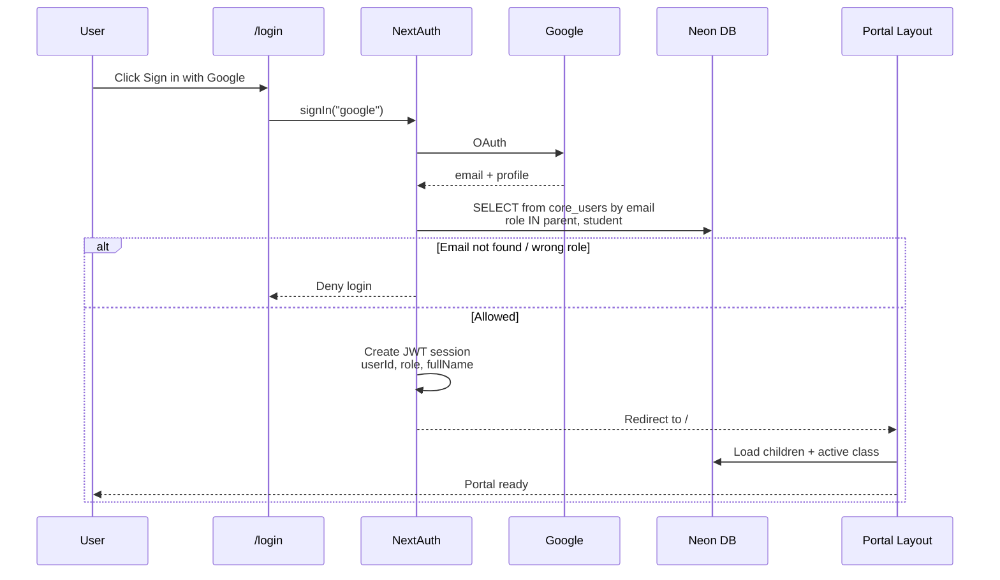

# Parent Portal — Login, Authentication & Multi-Child

## How parents / students log in

1. Open `/login`
2. Click **Sign in with Google**
3. NextAuth runs Google OAuth
4. After Google succeeds, the app checks the Google **email** in the database
5. If allowed → redirect to `/` (home). If not → stay on login with error

There is **no password / credentials login** in this portal.  
`core_users.password_hash` exists in the schema but is **not used** here.

**Prerequisite (admin must prepare data):**
- Parent or student email must exist in `core_users`
- `role` must be `parent` or `student`

---

## Auth stack

| Piece | Detail |
|---|---|
| Library | NextAuth v4 |
| Provider | Google OAuth only |
| Session | JWT cookie (about 30 days) |
| Config | [`lib/auth.ts`](../lib/auth.ts) |
| API route | [`app/api/auth/[...nextauth]/route.ts`](../app/api/auth/[...nextauth]/route.ts) |
| Login UI | [`components/portal/pages/LoginPageClient.tsx`](../components/portal/pages/LoginPageClient.tsx) |

---

## Login flow (step by step)



### Callback logic (`lib/auth.ts`)

1. **`signIn`** — allow only if email exists in `core_users` with role `parent` or `student`
2. **`jwt`** — store `userId`, `role`, `fullName` on the token
3. **`session`** — copy those fields to `session.user`

---

## Tables involved

### 1) Login / session only

**`core_users`**

| Column used | Purpose |
|---|---|
| `id` | Becomes `session.user.userId` |
| `email` | Must match Google email |
| `role` | `parent` or `student` |
| `full_name` | Display name in session |

Query at login:

```sql
SELECT id, full_name, email, role
FROM core_users
WHERE email = $googleEmail
  AND role IN ('parent', 'student')
LIMIT 1;
```

### 2) After login — children & class

| Table | Role |
|---|---|
| `core_parent_student_relations` | Links parent user → student(s) |
| `core_students` | Student profile; student login via `user_id` |
| `core_student_class_histories` | Active class + academic year |
| `core_classes` | Class name (e.g. P2 Resilient) |
| `core_level_grades` | Level (KG / Primary) |
| `core_schools` | School name |
| `core_academic_years` | Academic year (joined when needed) |

### Relation shape

```text
core_users (parent)
    └── core_parent_student_relations (user_id → student_id)  [1 parent : many children]
            └── core_students
                    └── core_student_class_histories (status='active')
                            ├── core_classes
                            ├── core_level_grades
                            └── core_academic_years

core_users (student)
    └── core_students.user_id = core_users.id   [usually 1 student profile]
            └── core_student_class_histories (status='active')
                    └── ...
```

---

## What is stored in session

Session does **not** store children or class. Only identity:

| Field | Source |
|---|---|
| `session.user.userId` | `core_users.id` |
| `session.user.role` | `core_users.role` (`parent` / `student`) |
| `session.user.fullName` | `core_users.full_name` |
| email / name / image | Google profile (NextAuth defaults) |

Server helpers:
- [`lib/auth-cached.ts`](../lib/auth-cached.ts) — `getCachedServerSession()`
- [`lib/session.ts`](../lib/session.ts) — `getSessionUser()`

Children are loaded later in [`app/(portal)/layout.tsx`](../app/(portal)/layout.tsx) via `getPortalChildren(userId, role)`.

---

## Parent vs student after login

### Parent

```sql
-- simplified from lib/data/server/children.ts
SELECT s.*, class, level, school
FROM core_parent_student_relations r
JOIN core_students s ON s.id = r.student_id
-- + active class history
WHERE r.user_id = $sessionUserId
  AND s.enrollment_status = 'active';
```

- One parent can have **many** children
- Each child appears in the Child Selector

### Student

```sql
-- simplified
SELECT s.*, class, level, school
FROM core_students s
-- + active class history
WHERE s.user_id = $sessionUserId
  AND s.enrollment_status = 'active';
```

- Student account is linked by `core_students.user_id`
- Usually one profile (themselves)

---

## How active class is resolved

For each student, take the latest active history row:

```sql
SELECT ch.class_id, ch.academic_year_id, ch.level_grade_id
FROM core_student_class_histories ch
WHERE ch.student_id = $studentId
  AND ch.status = 'active'
ORDER BY ch.id DESC
LIMIT 1;
```

Then join:
- `core_classes` → class name
- `core_level_grades` → level (used for KG vs Primary UI)
- `core_schools` → school name

Portal features (schedules, finance, attendance, etc.) filter by the **active child’s** `classId` + `academicYearId` (+ `studentId` when needed).

---

## Multi-child (parent with several kids)

1. `getPortalChildren()` returns **all** linked active students
2. `PortalProvider` keeps:
   - `portalChildren[]`
   - `activeChildId` (selected child)
3. Default selected child = first in the list
4. Selection is saved in browser `localStorage` key: `portal.activeChildId`
5. UI: [`ChildSelector`](../components/portal/ChildSelector.tsx) switches child
6. Pages use `useActiveChild()` so data reloads for the selected child only

Example:

```text
Parent login (core_users.id = 100)
  relations:
    100 → student 365 (Zayed, P2 Resilient)
    100 → student 370 (Rumaysaa, K1 Blossom)

Portal shows both cards.
User selects Zayed → schedules/finance use student 365 + class 79.
User selects Rumaysaa → same pages use student 370 + her class.
```

Session stays the same (`userId=100`, `role=parent`). Only **active child** changes in client state.

---

## Middleware & tenant

[`middleware.ts`](../middleware.ts):

- Blocks unauthenticated users → redirect `/login`
- Authenticated users on `/login` → redirect `/`
- Sets tenant headers from hostname (`kreativa` / `talenta`) for theme/branding

Important: **auth is not scoped by school/tenant**.  
Any allowlisted parent/student email can log in on any portal host. Tenant mainly affects theme/CSS.

---

## Admin checklist to enable login

### For a parent
1. Insert/update `core_users` with their Google email, `role = 'parent'`
2. Ensure student rows exist in `core_students`
3. Link them in `core_parent_student_relations` (`user_id`, `student_id`, `relation_type`)
4. Ensure each child has `core_student_class_histories` with `status = 'active'`
5. Student should be `enrollment_status = 'active'`

### For a student
1. Insert/update `core_users` with Google email, `role = 'student'`
2. Set `core_students.user_id` = that user’s `id`
3. Active class history + enrollment as above

---

## Quick “why can’t they see data?” checklist

| Symptom | Likely cause |
|---|---|
| Cannot login | Email missing in `core_users`, or role not `parent`/`student` |
| Login OK, no children | Missing `core_parent_student_relations` (parent), or `core_students.user_id` (student) |
| Child shown, no class | No `core_student_class_histories` with `status='active'` |
| Wrong child data | Wrong `activeChildId`, or history points to wrong `class_id` |
| Schedules empty | Weekly plan missing / draft-only / wrong `week_config` for that class+year |

---

## Key files

| Concern | File |
|---|---|
| Auth callbacks | `lib/auth.ts` |
| NextAuth route | `app/api/auth/[...nextauth]/route.ts` |
| Login button | `components/portal/pages/LoginPageClient.tsx` |
| Session types | `types/next-auth.d.ts` |
| Load children | `lib/data/server/children.ts` |
| Hydrate portal | `app/(portal)/layout.tsx` |
| Active child state | `components/portal/state/PortalProvider.tsx` |
| Child switcher | `components/portal/ChildSelector.tsx` |
| Route guard + tenant | `middleware.ts` |
